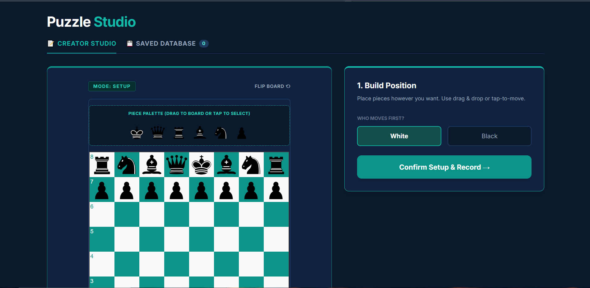

# ♟️ Chess Puzzle Studio

<p align="center">
  
</p>

<h1 align="center">Chess Puzzle Studio</h1>

<p align="center">
  A premium browser-native chess puzzle creation platform for building, recording, validating, and exporting tactical chess puzzles directly inside the browser.
</p>

<p align="center">
  
  
  
  
  
  
  
</p>

---

# ✨ Overview

Chess Puzzle Studio is a lightweight yet powerful browser-based chess puzzle creation environment built for:

- Chess players
- Tactical puzzle creators
- Coaches
- Developers
- Dataset builders
- Sleep-deprived humans making illegal bishop sacrifices at 3 AM

Everything runs entirely client-side.

No backend.  
No accounts.  
No setup pain.  
No npm-induced psychological warfare.

Simply open:

```bash
index.html
```

and start creating puzzles instantly.

---

# 🚀 Core Features

# 🎯 Interactive Position Builder

Create custom chess positions visually with:

- Drag & drop controls
- Tap-to-move support
- Piece palette insertion
- Standard setup restoration
- Board clearing
- Instant board flipping
- Free placement editing

Perfect for:

- Tactical studies
- Puzzle compositions
- Endgame positions
- Training exercises
- Analysis snapshots

---

# ♞ Smart Move Recording Engine

Automatically records:

- Legal chess moves
- SAN notation
- Move order
- Turn validation
- Real-time rule enforcement

Powered by:

- `chess.js`
- `chessboard.js`

Example:

```json
[
  "e4",
  "e5",
  "Nf3",
  "Nc6",
  "Bb5"
]
```

---

# 🔓 Free-Flow Puzzle Mode

If a custom position violates official chess legality rules, the application intelligently switches into unrestricted recording mode.

This allows creation of:

- Impossible positions
- Artistic compositions
- Experimental studies
- Puzzle fragments
- Fantasy tactical sequences

Because eventually every chess developer asks:

> “What if physics simply stopped applying to rooks?”

---

# 💾 Local Puzzle Database

Every puzzle is stored directly in browser localStorage.

Features include:

- Persistent local saving
- Instant loading
- Rename support
- Delete support
- Clipboard JSON copy
- Batch exporting
- Offline persistence

No external database required.

Humanity invented cloud-connected refrigerators for some reason.  
This app remains spiritually opposed to that concept.

---

# 📦 JSON Export Pipeline

Export puzzles into clean structured JSON datasets ready for:

- PostgreSQL
- MongoDB
- Chess engines
- APIs
- ML datasets
- Puzzle websites

Example schema:

```json
{
  "id": 1716912345678,
  "name": "Smothered Mate Study",
  "initial_fen": "rnbqkbnr/pppppppp/8/8/8/8/PPPPPPPP/RNBQKBNR",
  "turn": "w",
  "solution": [
    "e4",
    "e5",
    "Nf3",
    "Nc6",
    "Bb5"
  ]
}
```

---

# 🖥️ UI Highlights

The interface includes:

- Responsive layout
- Mobile-friendly interactions
- Animated toast notifications
- Interactive move history
- Touch controls
- Real-time move tracking
- Custom modal system
- Elegant dark UI styling
- Live validation feedback

The project intentionally avoids frontend frameworks like React or Vue to maintain:

- Fast startup speed
- Low complexity
- Maximum portability
- Zero build tooling

A rare modern web experience where opening the project does *not* require downloading 847MB of dependencies named things like:

```bash
ultra-hyper-reactive-webpack-plugin-final-final-v2
```

---

# ⚙️ Technology Stack

| Layer | Technology |
|---|---|
| Frontend | HTML5 |
| Styling | TailwindCSS |
| DOM Utilities | jQuery |
| Chess Logic | chess.js |
| Board Rendering | chessboard.js |
| Storage | Browser localStorage |

---

# 🧠 Architecture Overview

```text
Board Setup
    ↓
Position Validation
    ↓
Move Recording
    ↓
SAN Conversion
    ↓
Local Persistence
    ↓
JSON Export
```

Simple architecture.  
Threateningly efficient.

---

# 📂 Project Structure

```bash
Chess-Puzzle-Maker/
│
├── assets/
│   ├── banner.png
│   └── .gitkeep
│
├── index.html
├── README.md
└── LICENSE
```

Everything important lives inside a single deployable HTML file.

Tiny.  
Portable.  
Dangerously convenient.

---

# ⚡ Quick Start

# 1. Clone Repository

```bash
git clone https://github.com/bytepilot-16/Chess-Puzzle-Maker.git
```

---

# 2. Enter Project Folder

```bash
cd Chess-Puzzle-Maker
```

---

# 3. Launch Application

Simply open:

```bash
index.html
```

inside any modern browser.

That’s it.

No installation process.  
No package managers screaming at you.  
No configuration rituals under a blood moon.

---

# 🌐 Deployment

Can be deployed instantly on:

- GitHub Pages
- Netlify
- Vercel
- Firebase Hosting
- Any static hosting provider

Since the project is fully client-side, deployment is absurdly simple.

Refreshing concept in modern web development.

---

# 🔐 Privacy & Security

Chess Puzzle Studio is fully local-first.

This means:

✅ No accounts  
✅ No analytics  
✅ No telemetry  
✅ No cloud tracking  
✅ No external databases  
✅ Full local ownership of data  

Your puzzles remain on your machine unless manually exported.

A revolutionary feature now called:

> “basic privacy”

---

# 📱 Browser Compatibility

Tested on:

| Browser | Status |
|---|---|
| Chrome | ✅ |
| Firefox | ✅ |
| Edge | ✅ |
| Brave | ✅ |
| Mobile Chromium | ✅ |

---

# 🔮 Planned Features

Future improvements may include:

- PGN importing
- Stockfish WASM integration
- Engine evaluations
- Puzzle difficulty analysis
- IndexedDB migration
- Multiplayer review boards
- Cloud synchronization
- Move arrows & annotations
- Puzzle tagging system
- Theme customization

Tiny side projects have a habit of evolving into entire platforms.  
Like digital mold.

---

# 📸 Screenshots

## Creator Studio

<p align="center">
  
</p>

---

# 🧩 Why This Project Exists

Most online chess puzzle tools are:

- Slow
- Bloated
- Account-locked
- Overcomplicated
- Dependent on servers
- Hostile to experimentation

Chess Puzzle Studio was built to feel:

- Fast
- Lightweight
- Local-first
- Flexible
- Immediate
- Fun

A tactical sandbox instead of another subscription service trying to “revolutionize productivity with AI synergy.”

Humanity truly heard “move wooden horse” and invented SaaS billing structures.

---

# 📄 License

Distributed under the MIT License.

See the `LICENSE` file for more information.

---

# 👨‍💻 Author

## bytepilot-16

Built for chess enthusiasts, developers, puzzle composers, and people who somehow enjoy debugging board states recreationally.

---

# ⭐ Support

If you like the project:

- Star the repository
- Fork it
- Improve it
- Build weird puzzle generators with it
- Pretend your tactical rating is much higher than reality

Ancient chess internet traditions must be preserved.

---
Everything runs fully client-side with zero backend requirements.

No servers.
No databases to configure.
No package installation rituals demanded by the JavaScript gods.

Just open `index.html` and start building puzzles.

---

# ✨ Features

## 🎯 Position Builder

* Drag-and-drop chess editor
* Click-to-move support
* Spare piece palette
* Custom board setups
* Standard starting position reset
* Board flipping support

---

## ♞ Intelligent Move Recording

Automatically records:

* Legal chess moves
* SAN notation sequences
* Turn-based move validation
* Real-time rule enforcement

Powered by `chess.js`.

Example:

```json
[
  "e4",
  "e5",
  "Nf3",
  "Nc6",
  "Bb5"
]
```

---

## 🔓 Free-Flow Recording Mode

If a custom setup violates traditional chess legality rules, the engine automatically switches into unrestricted recording mode.

This allows creation of:

* composed studies
* impossible positions
* puzzle fragments
* experimental tactical sequences

Because chess developers eventually become chaos engineers.

---

## 💾 Local Puzzle Database

Every saved puzzle is stored directly inside browser localStorage.

Features include:

* persistent local saving
* rename support
* delete support
* instant loading
* clipboard JSON copy
* batch exporting

No external database required.

---

## 📦 JSON Export Pipeline

Export every saved puzzle into a clean JSON dataset suitable for:

* PostgreSQL
* MongoDB
* training datasets
* chess engines
* backend APIs
* puzzle websites

Example schema:

```json
{
  "id": 1716912345678,
  "name": "Tactical Sequence 1",
  "initial_fen": "rnbqkbnr/pppppppp/8/8/8/8/PPPPPPPP/RNBQKBNR",
  "turn": "w",
  "solution": [
    "e4",
    "e5",
    "Nf3",
    "Nc6",
    "Bb5"
  ]
}
```

---

# 🧠 System Architecture

## Frontend Stack

| Layer             | Technology           |
| ----------------- | -------------------- |
| UI Framework      | TailwindCSS          |
| DOM Utilities     | jQuery               |
| Chess Validation  | chess.js             |
| Interactive Board | chessboard.js        |
| Storage Layer     | Browser localStorage |

---

## Core Workflow

```text
Board Setup
    ↓
Position Validation
    ↓
Move Recording
    ↓
SAN Conversion
    ↓
Local Persistence
    ↓
JSON Export
```

---

# 🖥️ User Interface Highlights

* Responsive layout
* Mobile-friendly interactions
* Touch-enabled board controls
* Animated toast notifications
* Custom modal system
* Interactive move history
* Real-time mode switching

The project intentionally avoids frontend frameworks like React or Vue to maintain:

* fast startup speed
* portability
* low complexity
* zero build tooling

A rare modern web experience where opening the project does not require summoning 947 npm packages from the abyss.

---

# 📂 Project Structure

```bash
Chess-Puzzle-Maker/
│
├── index.html
├── LICENSE
└── README.md
```

Everything is self-contained inside a single deployable HTML file.

---

# ⚡ Getting Started

## 1. Clone the Repository

```bash
git clone https://github.com/bytepilot-16/Chess-Puzzle-Maker.git
```

---

## 2. Open the Project

```bash
cd Chess-Puzzle-Maker
```

---

## 3. Launch the Application

Simply open:

```bash
index.html
```

inside any modern browser.

You can also deploy instantly using:

* GitHub Pages
* Netlify
* Vercel
* Firebase Hosting

No backend configuration required.

---

# 🔐 Security & Privacy

Chess Puzzle Studio is fully client-side.

This means:

* no external database connections
* no account systems
* no analytics tracking
* no network-based storage
* complete local ownership of data

Your puzzles remain on your machine unless manually exported.

---

# 📱 Browser Compatibility

Tested on:

* Google Chrome
* Microsoft Edge
* Firefox
* Brave
* Mobile Chromium browsers

---

# 🛠️ Future Improvements

Planned features include:

* PGN importing
* Engine evaluation support
* Puzzle difficulty analysis
* Cloud synchronization
* IndexedDB migration
* Dark/light themes
* Multiplayer review boards
* Puzzle tags & categories

---

# 📸 Recommended README Additions

Add screenshots here for maximum GitHub attractiveness:

```md
## Screenshots

### Creator Studio


### Recording Mode


### Puzzle Database

```

People judge repositories by screenshots with terrifying speed. Like pigeons evaluating breadcrumbs.

---

# 📄 License

Distributed under the MIT License.

See `LICENSE` for more information.

---

# 👨‍💻 Author

### D. Shashank

Built as a lightweight browser-native chess puzzle authoring platform focused on simplicity, speed, and portability.

---
